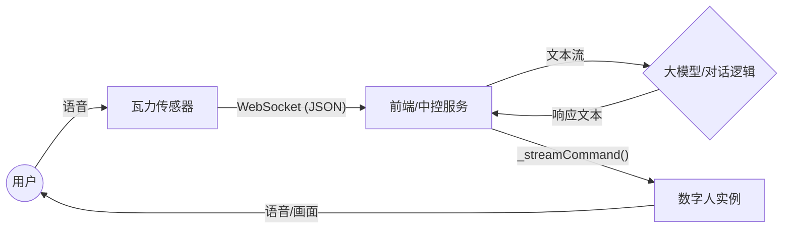

# 数字人-瓦力 ASR 集成实施文档

> **文档目标**: 指导工程师将瓦力传感器（ASR输入）与数字人SDK（输出）进行对接，实现语音驱动数字人的完整交互链路。
> **适用对象**: 前端/全栈开发工程师

---

## 🏗 1. 整体架构与数据流

### 1.1 数据链路图


### 1.2 核心模块
1.  **ASR 客户端模块**: 负责连接瓦力 WebSocket，解析 ASR 文本数据。
2.  **对话管理模块 (Controller)**: 负责接收 ASR 文本，(可选)发送给 LLM，将最终回复发送给数字人。
3.  **数字人 SDK 模块**: 负责初始化数字人并播放语音/动作。

---

## ✅ 2. 前置条件

### 2.1 硬件准备
- [ ] **瓦力传感器**: 已配置为服务端模式 (推荐) 或通过 ADB 映射的 USB 模式。
- [ ] **开发主机**: Windows/Mac，具备网络环境或 USB 连接能力。
- [ ] **显示设备**: 用于展示数字人页面。

### 2.2 软件环境
- [ ] **Node.js**: v16+
- [ ] **包管理器**: npm 或 pnpm
- [ ] **ADB 工具**: (仅 USB 模式需要) 确保 `adb devices` 能识别设备。

### 2.3 账号与鉴权
- [ ] **数字人相关**: `appkey`, `appsecret`, `licenseUrl`, `figure_id`, `voice_id` 等。
- [ ] **瓦力连接**: 确认瓦力 IP 地址及端口 (默认为 39999)。

---

## 🛠 3. 详细代码实现步骤 (Step-by-Step)

### 步骤一：项目初始化与依赖安装
创建一个新的前端项目或集成到现有项目中。

```bash
# 安装数字人 SDK 依赖
npm install axios uuid crypto-js tcplayer.js three
```

### 步骤二：封装 WebSocket ASR 客户端
创建一个 `WaliClient.js` 用于处理与瓦力的通信。

```javascript
// WaliClient.js
class WaliClient {
    constructor(url = 'ws://127.0.0.1:39999') {
        this.url = url;
        this.ws = null;
        this.onMessageCallback = null;
    }

    connect(onMessage) {
        this.onMessageCallback = onMessage;
        this.ws = new WebSocket(this.url);

        this.ws.onopen = () => {
            console.log('✅ 瓦力 ASR 连接成功');
        };

        this.ws.onmessage = (event) => {
            try {
                // 如果是二进制数据，跳过或按需处理
                if (event.data instanceof Blob) return;
                
                const msg = JSON.parse(event.data);
                if (msg.action === 'asr') {
                    this.handleASRMessage(msg.data);
                }
            } catch (e) {
                console.error('消息解析错误:', e);
            }
        };

        this.ws.onclose = () => {
            console.log('❌ 连接断开，尝试重连...');
            setTimeout(() => this.connect(this.onMessageCallback), 3000);
        };
    }

    handleASRMessage(dataStr) {
        // 解析讯飞格式数据
        // 注意：dataStr 可能是 JSON 字符串，需要再次 parse
        try {
            const data = JSON.parse(dataStr);
            // 这里仅提取最终结果，流式中间结果(pgs !== 'rpl')可根据需要处理
            if (data.text && data.text.ws) {
                let sentence = '';
                data.text.ws.forEach(wsItem => {
                    wsItem.cw.forEach(cwItem => {
                        sentence += cwItem.w;
                    });
                });
                
                // 只有当这句话结束时，或者你需要实时反馈时才回调
                // 此处简单起见，回调所有内容，由 Controller 决定如何使用
                if (this.onMessageCallback) {
                    this.onMessageCallback({
                        text: sentence,
                        isFinal: data.text.pgs === 'rpl' // rpl 表示句子替换/结束
                    });
                }
            }
        } catch (e) {
            console.error('ASR 数据解析错误', e);
        }
    }
}

export default WaliClient;
```

### 步骤三：初始化数字人
在主页面逻辑中（如 `App.vue` 或 `index.js`），初始化数字人。

```javascript
import { DigitalMan } from './DigitalMan.js'; // 假设SDK在本地或从npm引入

// ... 初始化代码 ...
const dm = new DigitalMan({
    appkey: 'YOUR_APP_KEY',
    appsecret: 'YOUR_APP_SECRET',
    // ... 其他配置 ...
    figure_id: 'YOUR_FIGURE_ID'
});

async function initDigitalMan() {
    await dm._initializer();
    console.log('✅ 数字人初始化完成');
}
```

### 步骤四：实现 IntegrationController (桥接逻辑)
将 ASR 的输出连接到数字人的输入。这里通常需要接入一个 LLM（大模型）来生成回复，**如果只是测试，可以做简单的“复读机”或关键词回复。**

```javascript
import WaliClient from './WaliClient.js';

const wali = new WaliClient('ws://127.0.0.1:39999'); // 根据实际IP修改

// 启动流程
async function startApp() {
    await initDigitalMan(); // 确保数字人已就绪

    // 连接瓦力，并定义回调
    wali.connect(async ({ text, isFinal }) => {
        console.log(`收到ASR: ${text}, 结束: ${isFinal}`);

        if (isFinal && text.trim().length > 0) {
            // 🛑 TODO: 这里建议接入 LLM 接口
            // const reply = await fetchLLMReply(text);
            
            // ⚡️ 简单测试：直接复读
            console.log(`正在驱动数字人说: ${text}`);
            
            // 发送文字驱动数字人
            await dm._streamCommand(text); 
            
            // 注意：如果只是单句，可能需要调用 _streamEnd()，视SDK具体逻辑而定
             await dm._streamEnd();
        }
    });
}

startApp();
```

---

## 🧪 4. 功能验证步骤

### 4.1 验证 ASR 链路
1.  启动网页应用，打开浏览器控制台 (Console)。
2.  对着瓦力说话：“你好，测试一下”。
3.  **观察**: 控制台是否打印出 `收到ASR: 你好，测试一下`。
4.  **排查**: 如果没收到，检查 WebSocket 连接状态 (Network 面板) 以及瓦力是否处于“服务端”模式。

### 4.2 验证数字人驱动链路
1.  修改代码，暂时手动触发一句硬编码的文本：`await dm._streamCommand("数字人启动成功");`。
2.  **观察**: 数字人是否开始播报。
3.  **排查**: 检查 `licenseUrl` 是否通过鉴权，DOM 元素是否宽高正确。

### 4.3 验证全链路交互
1.  恢复 IntegrationController 逻辑。
2.  对着瓦力说话：“今天天气怎么样”。
3.  **预期结果**:
    *   Wali 识别出文字。
    *   代码逻辑接收到文字。
    *   数字人复述文字（或回答内容）。

---

## ⚠️ 常见问题 (FAQ)

1.  **WebSocket 连接失败**:
    *   检查 PC 和瓦力是否在同一网段（Ping 一下瓦力 IP）。
    *   USB 模式下确认 `adb forward` 命令已执行。
2.  **数字人没声音/不显示**:
    *   浏览器可能需要用户交互（点击页面）才能自动播放音频。建议增加一个“开始体验”按钮，点击后再启动 `dm._initializer()`。
    *   检查 `id="Digital-Man"` 的 CSS 宽高。

---
*文档版本: v1.0 | 创建日期: 2026-01-22*
